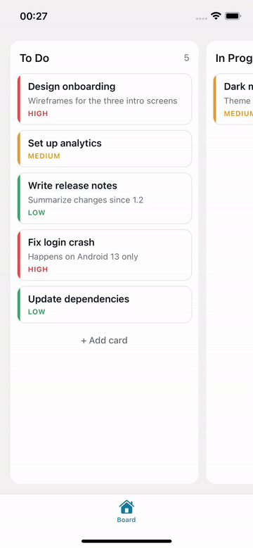

# react-native-kanban-dnd

A customizable drag-and-drop Kanban board for React Native, built on [Reanimated](https://docs.swmansion.com/react-native-reanimated/) and [Gesture Handler](https://docs.swmansion.com/react-native-gesture-handler/). Everything runs on the UI thread.

<p>
  
</p>

- Reorder cards within a column and move them between columns
- Animated drop gap, floating drag preview, and column highlight
- Auto-scrolls the board and columns when a card is dragged near an edge
- Custom card, header, footer, and empty-state renderers
- Light and dark themes, color overrides, and per-element style overrides
- Rules for which cards can be dragged and where they can be dropped
- Fully typed, with generics for your own card and column shapes

## Requirements

| Dependency | Supported | Tested with |
| --- | --- | --- |
| React Native | New Architecture | 0.86.3 |
| React | | 19.2.3 |
| Expo SDK (optional) | | 57 (`expo@57.0.24`) |
| `react-native-reanimated` | >= 4.0.0 | 4.5.1 |
| `react-native-worklets` | >= 0.5.0 | 0.10.1 |
| `react-native-gesture-handler` | >= 2.16.0 | 2.32.0 |

Reanimated 4 only runs on the [New Architecture](https://reactnative.dev/architecture/landing-page). It is on by default since React Native 0.76 and Expo SDK 52.

## Installation

### Expo

```sh
npx expo install react-native-kanban-dnd react-native-gesture-handler react-native-reanimated react-native-worklets
```

`babel-preset-expo` already includes the Worklets Babel plugin, so there's nothing else to configure. Rebuild your development build after adding the native dependencies.

### React Native CLI

1. Install the package and its peer dependencies:

   ```sh
   npm install react-native-kanban-dnd react-native-gesture-handler react-native-reanimated react-native-worklets
   ```

2. Add the Worklets Babel plugin to `babel.config.js`. It must be the **last** plugin in the list:

   ```js
   module.exports = {
     presets: ['module:@react-native/babel-preset'],
     plugins: [
       // ...other plugins
       'react-native-worklets/plugin',
     ],
   };
   ```

3. Install the iOS pods:

   ```sh
   cd ios && pod install
   ```

4. Clear the Metro cache and rebuild the app:

   ```sh
   npx react-native start --reset-cache
   npx react-native run-ios   # or run-android
   ```

See the [Reanimated](https://docs.swmansion.com/react-native-reanimated/docs/fundamentals/getting-started/) and [Gesture Handler](https://docs.swmansion.com/react-native-gesture-handler/docs/fundamentals/installation) installation guides if you run into build problems.

### Gesture Handler root

With either setup, wrap your app root in `GestureHandlerRootView`:

```tsx
import { GestureHandlerRootView } from 'react-native-gesture-handler';

export default function App() {
  return <GestureHandlerRootView style={{ flex: 1 }}>{/* ... */}</GestureHandlerRootView>;
}
```

## Usage

```tsx
import { KanbanBoard, useKanbanBoard, type KanbanColumnData } from 'react-native-kanban-dnd';

const initialColumns: KanbanColumnData[] = [
  {
    id: 'todo',
    title: 'To Do',
    cards: [
      { id: '1', title: 'Design onboarding', description: 'Wireframes for the intro screens' },
      { id: '2', title: 'Set up analytics' },
    ],
  },
  { id: 'doing', title: 'In Progress', cards: [] },
  { id: 'done', title: 'Done', cards: [] },
];

export function Board() {
  const { columns, onMoveCard } = useKanbanBoard(initialColumns);
  return <KanbanBoard columns={columns} onMoveCard={onMoveCard} />;
}
```

Long-press a card (250 ms by default) to pick it up.

### Controlled state

`KanbanBoard` is controlled: it renders `columns` and calls `onMoveCard` when a card is dropped in a new position. `useKanbanBoard` handles this for you. If you keep the state yourself (Redux, Zustand, a server, ...), use the `moveCard` helper:

```tsx
import { moveCard } from 'react-native-kanban-dnd';

<KanbanBoard
  columns={columns}
  onMoveCard={({ card, toColumnId, toIndex }) =>
    setColumns((prev) => moveCard(prev, card.id, toColumnId, toIndex))
  }
/>;
```

Update the state synchronously (optimistically) in `onMoveCard`. If the update is delayed, the card briefly jumps back to where it started.

## Customization

### Custom cards and columns

Cards and columns can hold any extra fields. Pass your types as generics to get them back, fully typed, in the render callbacks:

```tsx
type Task = { id: string; title: string; priority: 'low' | 'high' };

<KanbanBoard<Task>
  columns={columns}
  onMoveCard={onMoveCard}
  renderCard={({ card, isDragging }) => (
    <View style={[styles.card, isDragging && styles.lifted]}>
      <Text>{card.title}</Text>
      <Text>{card.priority}</Text>
    </View>
  )}
  renderColumnHeader={({ column, cardCount }) => (
    <Text style={styles.header}>
      {column.title} · {cardCount}
    </Text>
  )}
  renderColumnFooter={({ column }) => <Button title="Add card" onPress={() => addCard(column.id)} />}
  renderEmptyColumn={() => <Text>Drop tasks here</Text>}
/>;
```

`isDragging` is `true` for the floating copy of the card that follows the finger.

### Theme

The board follows the device color scheme by default. Override any color, or force a scheme:

```tsx
<KanbanBoard
  colorScheme="dark"
  theme={{
    columnBackground: '#101418',
    columnHighlightBackground: '#15314A',
    cardBackground: '#1B2229',
    cardBorder: '#2A333C',
    text: '#F2F5F7',
    mutedText: '#8A97A3',
  }}
  {...props}
/>
```

| Key | Used for |
| --- | --- |
| `boardBackground` | Behind the columns (transparent by default) |
| `columnBackground` | Column background |
| `columnHighlightBackground` | Column background while a card is dragged over it |
| `cardBackground`, `cardBorder` | Built-in card |
| `text`, `mutedText` | Titles, descriptions, counts, and the empty-column text |
| `shadow` | Shadow of the dragged card |

`lightTheme` and `darkTheme` are exported if you want to build on them.

### Styles

Each part of the board accepts a style override:

```tsx
<KanbanBoard
  styles={{
    boardContent: { paddingHorizontal: 24 },
    column: { borderRadius: 20 },
    columnTitle: { fontSize: 18, fontWeight: '700' },
    card: { borderRadius: 4 },
  }}
  {...props}
/>
```

Keys: `board`, `boardContent`, `column`, `columnHeader`, `columnTitle`, `columnCount`, `columnContent`, `card`, `cardTitle`, `cardDescription`, `emptyText`, `dragOverlay`.

Set column colors through `theme`, not `styles.column`, because the column background is animated. The `card*` styles only apply to the built-in card; with `renderCard` you style the card yourself.

### Drag rules

```tsx
<KanbanBoard
  // Locked cards can't be picked up.
  canDragCard={(card) => !card.locked}
  // Only finished work can be archived.
  canDropCard={(card, fromColumn, toColumn) => toColumn.id !== 'archived' || fromColumn.id === 'done'}
  {...props}
/>
```

While dragging, columns the card isn't allowed in fade out (see `blockedColumnOpacity`). If a card is dropped on one of them, it goes back to where it started.

### Events

```tsx
import * as Haptics from 'expo-haptics';

<KanbanBoard
  onDragStart={({ card, columnId, index }) => Haptics.impactAsync(Haptics.ImpactFeedbackStyle.Medium)}
  onDragEnd={({ card, fromColumnId, toColumnId, toIndex }) => {
    // toColumnId is null when the drag was cancelled
  }}
  {...props}
/>;
```

## Props

| Prop | Type | Default | Description |
| --- | --- | --- | --- |
| `columns` | `TColumn[]` | required | Board data |
| `onMoveCard` | `(event: KanbanMoveEvent) => void` | required | Called when a card is dropped in a new position |
| `onDragStart` | `(event) => void` | | A card was picked up |
| `onDragEnd` | `(event) => void` | | A drag finished, whether it moved the card or not |
| `canDragCard` | `(card, column) => boolean` | | Return `false` to lock a card |
| `canDropCard` | `(card, fromColumn, toColumn) => boolean` | | Return `false` to block a column |
| `renderCard` | `(info) => ReactNode` | built-in card | Custom card |
| `renderColumnHeader` | `(info) => ReactNode` | title and count | Custom column header |
| `renderColumnFooter` | `(info) => ReactNode` | | Rendered below the cards |
| `renderEmptyColumn` | `(info) => ReactNode` | `emptyColumnText` | Rendered in empty columns |
| `theme` | `Partial<KanbanTheme>` | | Color overrides |
| `colorScheme` | `'light' \| 'dark'` | device setting | Base theme |
| `styles` | `KanbanStyles` | | Style overrides |
| `columnWidth` | `number` | `280` | Column width |
| `cardGap` | `number` | `8` | Space between cards |
| `columnGap` | `number` | `12` | Space between columns |
| `longPressDelay` | `number` | `250` | Press duration before a drag starts (ms) |
| `autoScrollThreshold` | `number` | `60` | Distance from an edge that starts auto-scroll |
| `autoScrollSpeed` | `number` | `12` | Maximum auto-scroll speed (points per frame) |
| `dragScale` | `number` | `1.03` | Scale of the dragged card |
| `dragRotation` | `string` | `'2deg'` | Rotation of the dragged card |
| `blockedColumnOpacity` | `number` | `0.4` | Opacity of columns the dragged card can't be dropped into |
| `showColumnCount` | `boolean` | `true` | Show the card count in the default header |
| `emptyColumnText` | `string` | `'No cards'` | Text in empty columns |

## Example app

The `example/` folder is an Expo app that uses the library straight from `src/`:

```sh
yarn               # library dependencies
yarn example install
yarn example ios
```

## Development

```sh
yarn typecheck
yarn lint          # Biome: lint, formatting, and import order
yarn format        # apply Biome fixes
yarn test
yarn build         # outputs to lib/
```

A Husky pre-commit hook runs `lint`, `typecheck`, and `test`.

## License

MIT
